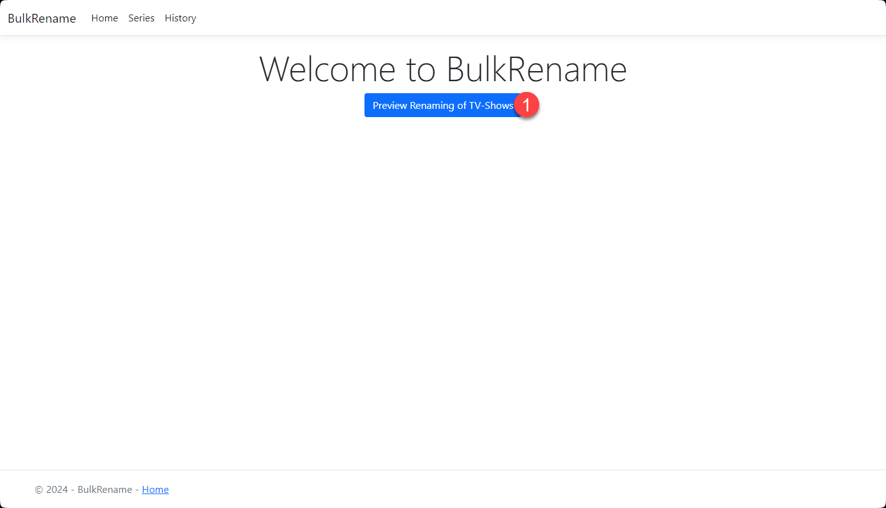
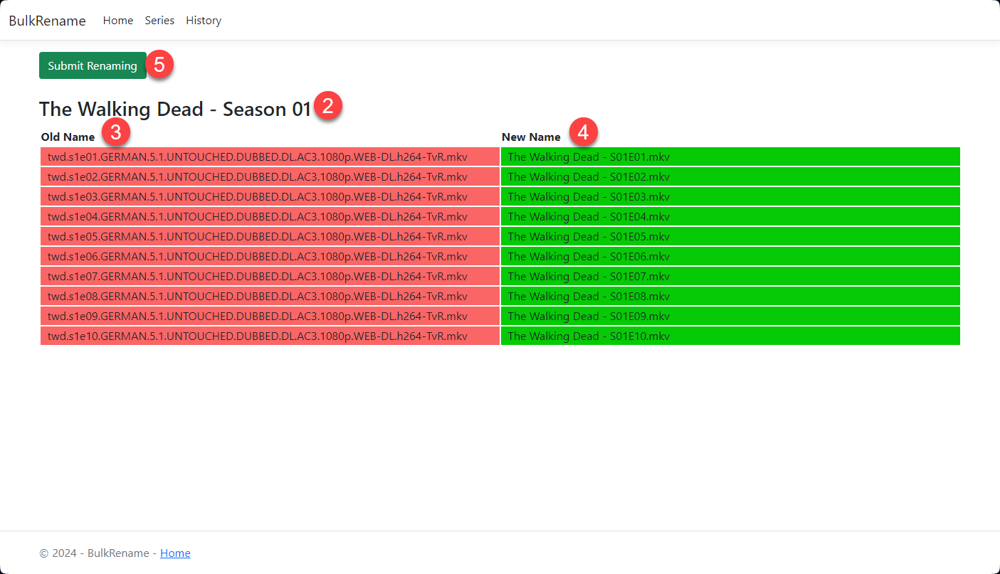
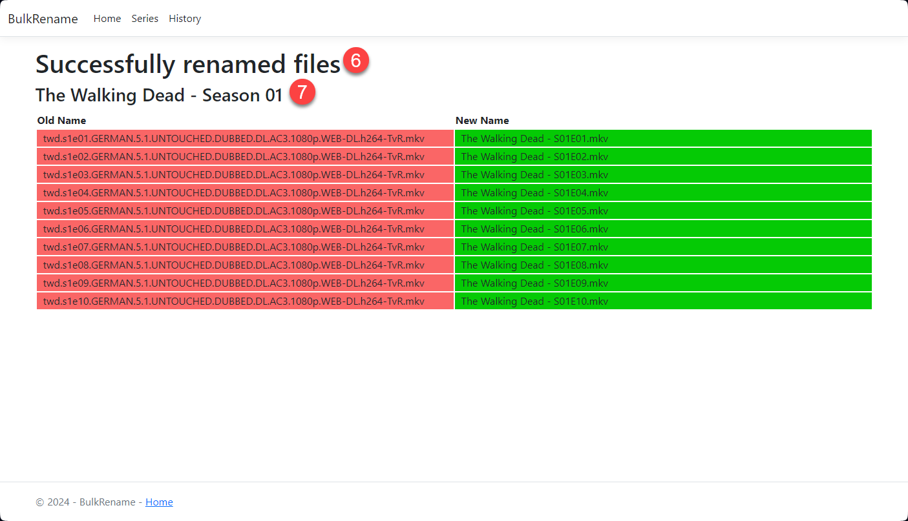
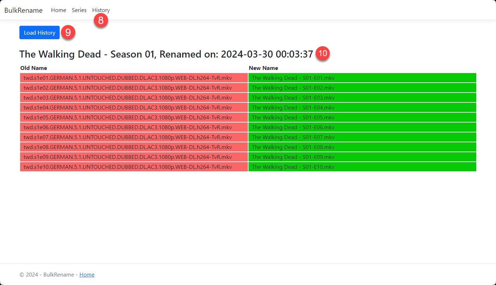

<div align="center">

[](#ReadMe)

[](https://hub.docker.com/r/ramoy/bulkrename)
[](https://github.com/Ramo-Y/BulkRename/blob/master/LICENSE)
[](https://github.com/Ramo-Y/BulkRename/pulse)
[](https://github.com/Ramo-Y/BulkRename/actions/workflows/build-test.yml)
[](https://github.com/Ramo-Y/BulkRename/actions/workflows/build-test-release.yml)
[](#contributors-)
[](https://github.com/sponsors/Ramo-Y)

[](https://github.com/Ramo-Y/BulkRename/issues)
[](https://github.com/Ramo-Y/BulkRename/issues?q=is%3Aissue+is%3Aclosed)

</div>

- [Description](#description)
- [Installation](#installation)
  - [Install BulkRename with Docker](#install-bulkrename-with-docker)
    - [Basic installation without history saving and SEQ](#basic-installation-without-history-saving-and-seq)
    - [With SQL Server as a docker container](#with-sql-server-as-a-docker-container)
    - [Environment variables](#environment-variables)
      - [PersistanceMode](#persistancemode)
      - [DbConnectionTimeOutInSeconds](#dbconnectiontimeoutinseconds)
      - [SeqUrl](#sequrl)
        - [SeqApiKey](#seqapikey)
      - [SupportedFileEndings](#supportedfileendings)
      - [FoldersToIgnore](#folderstoignore)
- [Usage](#usage)
  - [Folder structure](#folder-structure)
  - [Home Page](#home-page)
  - [Series overview](#series-overview)
  - [Renamed series overview](#renamed-series-overview)
  - [History](#history)
- [Development](#development)
  - [Adding new languages](#adding-new-languages)
  - [Contributors ✨](#contributors-)


# Description
This project is about bulk-renaming of TV show files for a clean file structure.

Sometimes, if you have files named as follows: `twd.s1e02.GERMAN.5.1.UNTOUCHED.DUBBED.DL.AC3.1080p.WEB-DL.h264-TvR.mkv`, your media server may not be able to match the correct TV show or episodes. Also, this seems messy and being a lazy person, I got tired of renaming them manually and created this tool.

# Installation

## Install BulkRename with Docker
Please use the following `docker-compose.yml` file and replace the values with your own.

### Basic installation without history saving and SEQ

```yaml
version: '3.7'
services:
  bulkrename:
    image: ramoy/bulkrename:latest
    container_name: "bulkrename"
    environment:
      ASPNETCORE_URLS: http://*:8080
      SupportedFileEndings: "mkv;mp4;m4v;avi"
      FoldersToIgnore: ".@__thumb"
      TZ: "Europe/Zurich"
    ports:
      - "8080:80"
    volumes:
      - "/share/Downloads/Files://app//Files//" # folder in which your TV show files must be located at the time of renaming
      - "/share/Downloads/Logs://app//Logs//" # optional to have logs available outside docker
```

### With SQL Server as a docker container
If you want to keep your renaming history, you can do this with a JSON file or database (see also [PersistanceMode](#PersistanceMode)), in this example a SQL Server is used:

```yaml
version: '3.7'
services:
  ms-sql-server:
    image: mcr.microsoft.com/mssql/server:2022-latest
    container_name: "ms-sql-server"
    environment:
      ACCEPT_EULA: "Y"
      SA_PASSWORD: "SuperStrong@PasswordHere_42"
      MSSQL_PID: Express
      TZ: "Europe/Zurich"
    ports:
      - "1433:1433"
    volumes:
      - "/share/Downloads/BulkRename/Data:/var/opt/mssql"
  bulkrename:
    depends_on:
      - "ms-sql-server"
    image: ramoy/bulkrename:latest
    container_name: "bulkrename"
    environment:
      ASPNETCORE_URLS: http://*:8080
      PersistanceMode: "Database"
      DbServer: "ms-sql-server"
      DbName: "BulkRename_DB_Live"
      DbPort: "1433"
      DbUser: "sa"
      DbPassword: "SuperStrong@PasswordHere_42"
      DbConnectionTimeOutInSeconds: "40"
      SupportedFileEndings: "mkv;mp4;m4v;avi"
      FoldersToIgnore: ".@__thumb"
      SeqUrl: "https://IP_ADRESS:PORT" # only required if SEQ is used
      SeqApiKey: "YOUR_SECRET_API_KEY" # only required if SEQ is used
      TZ: "Europe/Zurich"
    ports:
      - "8080:80"
    volumes:
      - "/share/Downloads/Files://app//Files//" # folder in which your TV show files must be located at the time of renaming
```

### Environment variables

#### PersistanceMode
The PersistanceMode defines how the history of the renamed files is to be saved. You have the following three options:
| Mode     | Description                                                                                                                                                            |
|----------|------------------------------------------------------------------------------------------------------------------------------------------------------------------------|
| None     | No history is saved, it's the default option if not specified                                                                                                          |
| JSON     | The renaming history is saved in a json file. You must also specify where the history should be saved by mapping the volume for the `//app//RenamingHistory//` folder. |
| Database | Requires a database and connection values. Currently, only MS SQL Server is supported.                                                                                  |

Note: It has happened before that I have renamed a series, the renaming was not correct, but I only noticed this when I was watching the series. Therefore, the saving of the renaming history was added. If you always check carefully, you may not need this feature.

#### DbConnectionTimeOutInSeconds
The container usually starts faster than the database, the application tries to establish a connection until the specified time in seconds has elapsed. Only needs to be set if Database has been selected as PersitanceMode.

#### SeqUrl
BulkRename uses Serilog and Seq for logging, you can add an IP-Address and port if you want to use it. Check out the [Seq documentation](https://docs.datalust.co/docs/using-serilog) for more information.

##### SeqApiKey
You may add an API Key for your application to identify itself or secure your Seq instance. See [Seq documentation](https://docs.datalust.co/docs/api-keys) for details.

#### SupportedFileEndings
Add here semicolon ';' separated values for endings of video files if you want to limit them. This can be useful for example when there are other files in the folders like subtitles or ReadMe files.

#### FoldersToIgnore
Add here semicolon ';' separated values for folders which should be ignored. QNAP generates sometimes a '.@__thumb' folder after detecting video files in a folder, which will cause an exception while searching files.

# Usage
## Folder structure
For the application to recognize the files and rename them correctly, a folder structure must be created according to the following pattern:
```
/Downloads
  /Files
    /The Walking Dead
      /Season 01
        twd.s1e01.GERMAN.5.1.UNTOUCHED.DUBBED.DL.AC3.1080p.WEB-DL.h264-TvR.mkv
        twd.s1e02.GERMAN.5.1.UNTOUCHED.DUBBED.DL.AC3.1080p.WEB-DL.h264-TvR.mkv
        twd.s1e03.GERMAN.5.1.UNTOUCHED.DUBBED.DL.AC3.1080p.WEB-DL.h264-TvR.mkv
        twd.s1e04.GERMAN.5.1.UNTOUCHED.DUBBED.DL.AC3.1080p.WEB-DL.h264-TvR.mkv
        twd.s1e05.GERMAN.5.1.UNTOUCHED.DUBBED.DL.AC3.1080p.WEB-DL.h264-TvR.mkv
        twd.s1e06.GERMAN.5.1.UNTOUCHED.DUBBED.DL.AC3.1080p.WEB-DL.h264-TvR.mkv
        ...
```
The files must already be sorted by name according to the episode order for the renaming to work correctly. It also supports renaming multiple TV shows and seasons at once, there is no limitation in this regard.

## Home Page
This is the home page with the **Preview Renaming of TV-Shows (1)** button in the middle. Pressing the button takes you to the preview page.



## Series overview
On the preview page, the entries are grouped by **Series - Season (2)**, and the **original name (3)** and the **new name after renaming (4)** are displayed. If the new file names are correct, the renaming can be performed with **Submit Renaming (5)**.



## Renamed series overview
If the renaming was successful, this is displayed on the page with the message **Successfully renamed files (6)**. Here the renames are also grouped by **series - season (7)**.



## History
Call up the history page by pressing **History (8)**. The first time, the page will be empty, but if you press **Load History (9)**, your entire renaming history will be loaded, grouped by **series - season - date and time of renaming (10)**. Once loaded, the history is retained until you restart the application or reload it by pressing the button again.



# Development
Please read the [development documentation](./DEVELOPMENT.md) if you would like to participate in the development.

## Adding new languages
This app can provide multiple languages and includes already the languages `English`, `German`, and `Hungarian`. A new language can be added within a few steps, to do this, please check out the [documentation](./DEVELOPMENT.md#languages).

## Contributors ✨

<!-- ALL-CONTRIBUTORS-LIST:START - Do not remove or modify this section -->
<!-- prettier-ignore-start -->
<!-- markdownlint-disable -->
<table>
  <tbody>
    <tr>
      <td align="center" valign="top" width="14.28%"><a href="https://github.com/sszemtelen"><br /><sub><b>Roland.</b></sub></a><br /><a href="#translation-sszemtelen" title="Translation">🌍</a></td>
      <td align="center" valign="top" width="14.28%"><a href="https://github.com/Ramo-Y"><br /><sub><b>Ramazan Yilmaz</b></sub></a><br /><a href="#code-Ramo-Y" title="Code">💻</a></td>
      <td align="center" valign="top" width="14.28%"><a href="https://allcontributors.org"><br /><sub><b>All Contributors</b></sub></a><br /><a href="#doc-all-contributors" title="Documentation">📖</a></td>
    </tr>
  </tbody>
</table>

<!-- markdownlint-restore -->
<!-- prettier-ignore-end -->

<!-- ALL-CONTRIBUTORS-LIST:END -->
